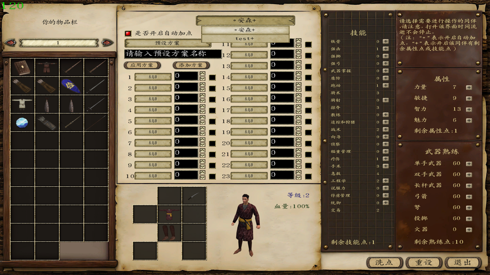

  

# Mount-Blade-Warband-Functional-Package

I wanted the developers of "Mount&amp;Blade Warband" to be able to easily add some useful features by using the included functionality package. So I created this open-source functionality package.我想让骑马与砍杀的开发者可以利用里面的功能包更方便的添加实用的一些功能，所以弄了一个这个开源的功能包。

------

[TOC]

## 新加点系统（NewAutoAddPointSystem）

:rice: 介绍：新加点系统集切换npc、物品栏、同伴装备、加点、洗点、自动加点等于一身，是比较好用的系统。

:rainbow:截图：

